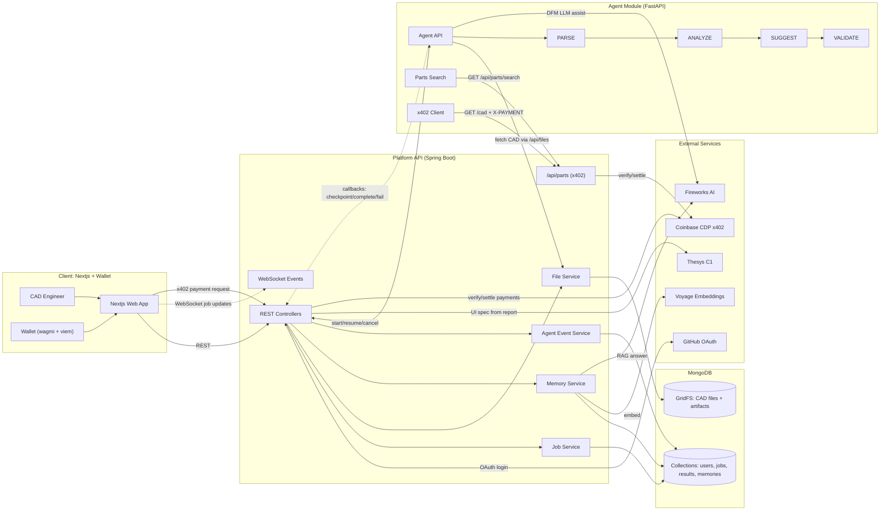

<p align="center">
  <br />
  <br />
  <i>The ultimate multi-agent orchestrated CAD analysis and update platform.</i>
</p>

# tactile3d


## System Architecture (Mermaid)



## How to Use

1. Export your CAD design as a `.step` file in Fusion 360.
2. Upload the `.step` file to the platform.
3. Let the AI agents analyze and critique your design for DFM and performance.
4. Update your design based on the AI's suggestions.
5. Repeat steps 2-4 until your design is optimized.
6. Chat with the AI to get more insights and suggestions.
7. Generate a report of your design's DFM and performance.

## Tech Stack

- Frontend: Nextjs (Vercel) + TailwindCSS
- Backend: Spring Boot + MongoDB + GridFS + WebSocket
- AI: FastAPI + PARSE + Fireworks AI + Voyage Embeddings + Thesys C1
- Payments: Coinbase CDP x402
- Authentication: GitHub OAuth

## x402 Agent Payments

The CAD agent supports autonomous payments for external x402-protected services using the Coinbase x402 protocol on **Base Sepolia testnet** (no real funds required).

**Features:**

- **Budget Control** - Set spending limit before upload via popup
- **Parts Search** - Search for screws, bearings, motors during chat
- **Automatic Payment** - Agent signs x402 payments for premium CAD data

### Parts API Endpoints

| Endpoint                          | Auth     | Description                     |
| --------------------------------- | -------- | ------------------------------- |
| `GET /api/parts/search?query=...` | None     | Search parts catalog (free)     |
| `GET /api/parts/{partNumber}`     | None     | Get part details (free)         |
| `GET /api/parts/{partNumber}/cad` | **x402** | Download CAD (requires payment) |

### Available MOCK Parts Catalog

| Part Number     | Name                            | Price (test USDC) |
| --------------- | ------------------------------- | ----------------- |
| `MC-M3X10-SHCS` | M3 x 10mm Socket Head Cap Screw | $0.01             |
| `MC-MR63ZZ`     | MR63ZZ Miniature Ball Bearing   | $0.02             |
| `NEMA17-42`     | NEMA 17 Stepper Motor           | $0.05             |
| `LM8UU`         | LM8UU Linear Ball Bearing       | $0.01             |

### x402 Payment Flow

```
Agent → GET /api/parts/MC-M3X10-SHCS/cad
     ← 402 Payment Required (price: $0.01 USDC)
Agent → Signs payment with wallet (Base Sepolia)
Agent → GET /cad + X-PAYMENT header
     → Backend verifies via CDP Facilitator API
     → Backend settles payment
     ← 200 OK + CAD data + transaction hash
```

**Setup:**

```bash
cd agent
pip install -e .
python -m tools.x402_client  # Generate wallet
# Fund at: https://faucet.cdp.coinbase.com/
```

Add to `.env`:

```
X402_AGENT_PRIVATE_KEY=0x...
X402_NETWORK=base-sepolia
```

Powered by [CadQuery](https://cadquery.readthedocs.io/en/latest/apireference.html#id1) - Python library for controlling parametric 3D CAD models
