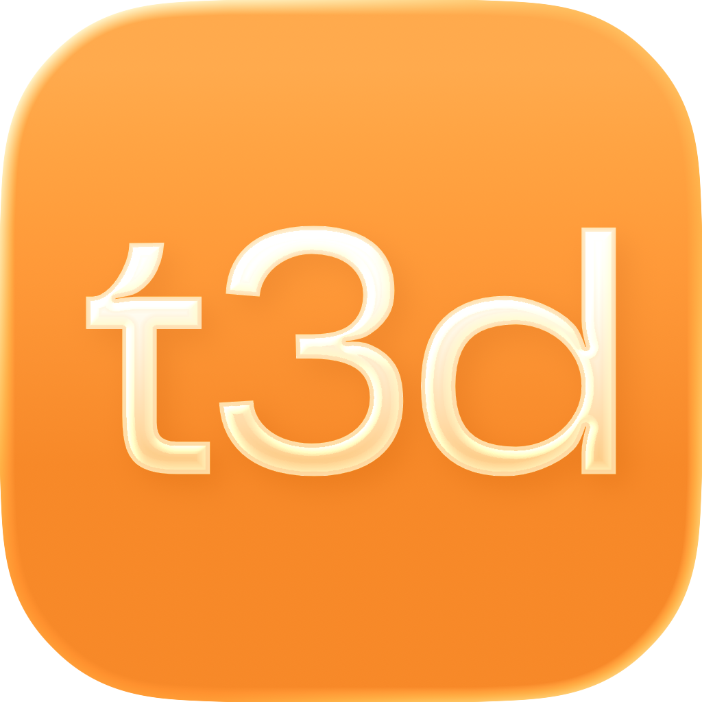
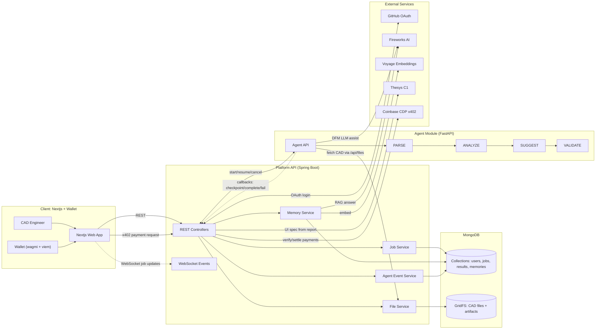

  

# tactile3d

The ultimate CAD analysis and update platform.

## System Architecture (Mermaid)

## How to Use

1. Export your CAD design as a `.step` file in Fusion 360.
2. Upload the `.step` file to the platform.
3. Let the AI agents analyze and critique your design for DFM and performance.
4. Update your design based on the AI's suggestions.
5. Repeat steps 2-4 until your design is optimized.
6. Chat with the AI to get more insights and suggestions.
7. Generate a report of your design's DFM and performance.

## Tech Stack

- Frontend: Nextjs (Vercel) + TailwindCSS + Shadcn UI
- Backend: Spring Boot + MongoDB + GridFS + WebSocket
- AI: FastAPI + PARSE + Fireworks AI + Voyage Embeddings + Thesys C1
- Payments: Coinbase CDP x402
- Authentication: GitHub OAuth
